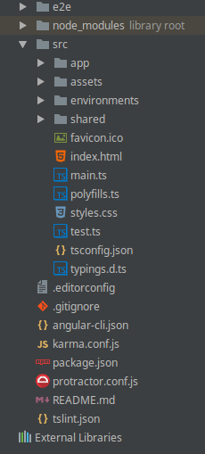

# Modern icons for Intellij products

So.. I got sick of looking at the boring icons set included with Intellij and was jealous of some of the cool icons packs you can get in Atom, Sublime and VSCode and so this is the result.

This icon pack for IntelliJ is based on the the [Afterglow Sublime Text](https://github.com/YabataDesign/afterglow-theme) theme,
and replaces the default sidebar icons of IntelliJ, WebStorm etc. No other theme changes are made. It should be compatible with all IntelliJ IDEs.

IMHO this theme looks best with dark themes, but hey.. try it on light if you swing that way.

# Screenshot

New icons! Screenshot is from WebStorm.

# Usage

Import 'intellij-modern-icons.jar' into your fav Intellij product using File\Settings\Plugins\Install plugin from disk.

# Acknowledgments

I've gotta give shout-outs to the following sources:

[Afterglow Sublime Text](https://github.com/YabataDesign/afterglow-theme)
(used for the icon-set)

[101 Loops](https://github.com/101loops/idea-coffee-test-icon)
(provided inspiration for this mod)

# License

The project is available under the MIT license, the original Afterglow icons are copyright by [Yabata Design](https://github.com/YabataDesign).